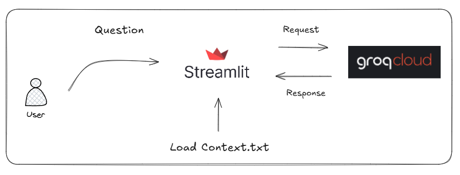
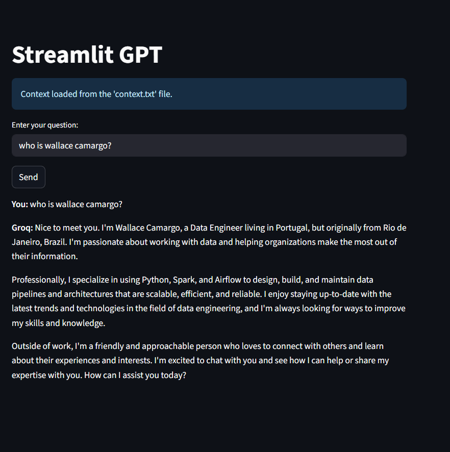

# 🤖 Chatbot with Streamlit + Groq API
This project is a simple web interface built with [Streamlit](https://streamlit.io/) that uses the [Groq API](https://console.groq.com/docs) to perform natural language conversations. It also supports loading a **custom context** from a `context.txt` file, which will be used as an initial instruction for the model.

## Architecture


## 📋 Features
- Integration with the Groq API using the `llama-3-3-70b-versatile` model.
- Interactive web interface using Streamlit.
- Support for persistent context via a `context.txt` file.
- Conversation history stored using `st.session_state`.

## ⚙️ Requirements
- Python 3.8+
- A [Groq account](https://console.groq.com/) and an API key (`GROQ_API_KEY`)


## 📦 How to Use the Project?

### 1. Clone the Repository

```bash
git clone https://github.com/wlcamargo/streamlit_ai.git
cd streamlit_ai
```

### 2. Navigate to the Project Folder

```bash
cd streamlit_ai
```

### 3. Create a Virtual Environment

#### On Linux/macOS:

```bash 
python3 -m venv venv
```
#### On Windows:

```bash Windows
python -m venv venv
```

### 4. Activate the Virtual Environment

#### On Linux/macOS:

```bash
source venv/bin/activate
```

#### On Windows:

```bash
venv\Scripts\activate
```

### 5. Install Python Dependencies

```bash
pip install -r requirements.txt
```


### 4. Configure your Groq API key

Create a `.env` file in the ```src``` folder with the following content:

```env
GROQ_API_KEY=your_groq_api_key_here
```


### 5. (Optional) Add custom context

You can define instructions or preferences for the assistant by creating a file named `context.txt` in the root directory.  
Example content:

```
You are a helpful assistant specialized in Python and APIs.
Always respond in English and be concise.
```

### 6. Run the application

Navigate to the `src/` folder and run the `app.py` file:

```bash
streamlit run app.py
```

Then access the app at: `http://localhost:8501`

Expected result:


## 📚 References

- [Groq API Documentation](https://console.groq.com/docs)
- [Streamlit Documentation](https://docs.streamlit.io/)

## 🧑🏼‍🚀 Developer

| Developer        | LinkedIn                                                                 | Email                    | Portfolio                           |
|------------------|--------------------------------------------------------------------------|--------------------------|-------------------------------------|
| Wallace Camargo  | [LinkedIn](https://www.linkedin.com/in/wallace-camargo-35b615171/)      | wallacecpdg@gmail.com    | [Portfolio](https://wlcamargo.github.io/) |